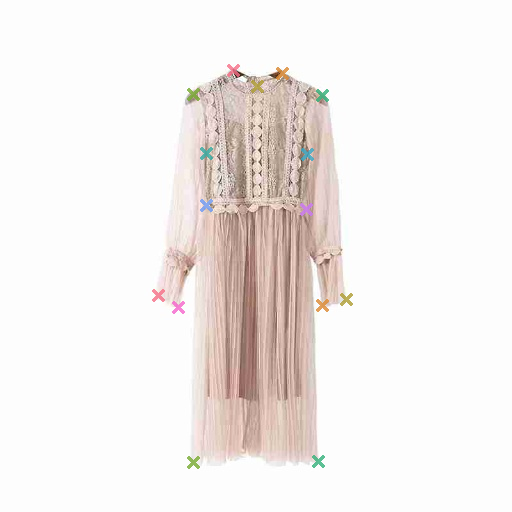
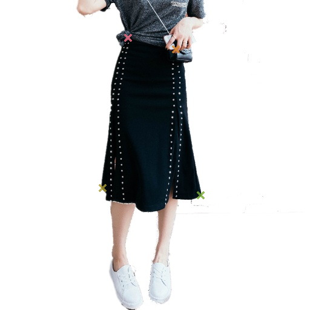

# A Pytorch Implementation of Cascaded Pyramid Network for FashionAI Key Points Detection

This code implement the [Cascaded Pyramid Network for Multi-Person Pose Estimation](https://arxiv.org/abs/1711.07319) in Pytorch to detect key points of clothing. It was started before offical code released so there are some differences. A variety of modifications on CPN are tested. ResNet-152 backbone and SENet-154 backbone show better results.

<div align="center">
    
<p> Example output of CPN with ResNet-152 backbone </p>
</div>

## Getting Started

### Dependency

- Python3.5
- Numpy
- Pandas
- PyTorch
- cv2
- scikit-learn
- py3nvml and nvidia-ml-py3
- tqdm

### Data Preparation

Download [FashionAI dataset](https://tianchi.aliyun.com/competition/information.htm?spm=5176.11165261.5678.2.34b72ec5iFguTn&raceId=231648&_lang=en_US) and put files in such structure:

	DATA_DIR/
		   |-- wu_train/
		   |    |-- Annotations/
		   |    |    |-- annotations.csv
		   |    |-- Images/
		   |    |    |-- blouse
		   |    |    |-- ...
		   |-- r1_train/
		   |    |-- Annotations/
		   |    |    |-- annotations.csv
		   |    |-- Images/
		   |    |    |-- blouse
		   |    |    |-- ...
		   |-- ...

DATA\_DIR is the root path of the fashionAI Dataset.

- wu\_train -> [update] warm\_up\_train\_20180222.tar
- r1\_train -> fashionAI\_key\_points_train_20180227.tar.gz
- r1\_test\_a -> fashionAI\_key\_points\_test\_a_20180227.tar
- r1\_test\_b -> fashionAI\_key\_points\_test\_b\_20180418.tgz
- r2\_test\_a -> round2\_fashionAI\_key\_points\_test\_a\_20180426.tar
- r2\_test\_b -> round2\_fashionAI\_key\_points\_test\_b\_20180530.zip.zip

In `config.py`, please specify a directory `proj_path` to save the data, checkpoints and results. Specify `data_dir` as `DATA_DIR`.

### Pretrained Model

Pre-trained [ResNet152](https://github.com/pytorch/vision/blob/master/torchvision/models/resnet.py) and [SENet154](https://github.com/Cadene/pretrained-models.pytorch/blob/master/pretrainedmodels/models/senet.py)  are used. Normally, the download will start automatically when the pretrained weight is needed.

## Training

**Hyperparameters such as `batch size`, `cuda devices`, `learning rate` can be set in `config.py`**

### Train from scratch

`python3 src/stage2/trainval.py -c {clothing type}`

Use `-c` or `--clothes` to choose the clothing type. It should be one of the following five types: **blouse, dress, outware, skirt, trousers**.

You can also run

`bash src/stage2/autorun.sh`

It actually runs `stage2/trainval.py` five times for five clothing types.

### Resume training from a checkpoint

`python3 src/stage2/trainval.py -c {clothing type} -r {path/to/the/checkpoint}`

When resume the training, **step count**, **learning rate** and **optimizer state** will also be restored from the checkpoint. For SGD optimizer, optimizer state contains the momentum for each trainable parameter.

### Behind training script

Data preprocessing is performed in `stage2/data_generator.py` which is called during the training

Two networks are used during this challenge, which are `stage2/cascaded_pyramid_network.py` and `stage2v9/cascaded_pyramid_network_v9.py`. The final score results from ensemble learning. The two networks share the same architecture with different backbones. 

All other versions are failed experiments and can be ignored for now.

## Inference

### Evaluate on validation set

To test a single model, run

`python3 src/stage2/predict_one.py -c {clothing type} -g {gpu index} -m {path/to/the/model} -v {True/False}`

To test ensemble performance of two models, run

`python3 src/stage2/predict_ensemble.py -c {clothing type} -g {gpu index} -m1 {path/to/the/model1} -m2 {path/to/the/model2} -v {True/False}`

A normalized error will be printed at the end of the program.

### Generate submission on test set

To test a single model, run

`python3 src/kpdetector/predict_one.py -c {clothing type} -g {gpu index} -m {path/to/the/model} -v {True/False}`

To test ensemble performance of two models, run

`python3 src/kpdetector/predict_ensemble.py -c {clothing type} -g {gpu index} -m1 {path/to/the/model1} -m2 {path/to/the/model2} -v {True/False}`

run `python3 src/kpdetector/concatenate_results.py` to merge all results in a `.csv` file for submission.

## Experiments (reduction of normalized error)

- Replace ResNet50 by ResNet152 as backbone network **(-0.5%)**
- Increase input resolution from 256x256 to 512x512 **(-2.5%)**
- Gaussian blur on predicted heatmap **(-0.5%)**
- Reduce rotaton angle from 40 degree to 30 for data augmentation **(-0.6%)**
- Use ```(x+2, y+2)``` where ```(x, y)``` is max value coordinate **(-0.4%)**
- Use 1/4 offset from coordinate of the max value to the one of second max value **(-0.2%)**
- Flip left to right for data augmentation **(-0.2%)**

## Benchmark

This solution achieved LB 3.82% in Tianchi FashionAI Global Challenge 17th place out 2322 teams. Check the leaderboard [here](https://tianchi.aliyun.com/competition/rankingList.htm?spm=5176.11165320.0.0.29762af1InLUXu&raceId=231648&season=1&_lang=en_US). 
